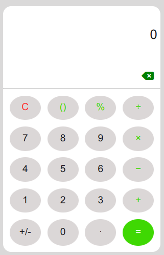

# JavaScript Calculator

A fully functional calculator built using HTML, CSS, and JavaScript that supports basic arithmetic operations, parentheses, percentages, and decimals. The calculator adheres to the BODMAS rules and uses a custom algorithm to evaluate expressions.

## Features

- **Basic Operations**: Addition, Subtraction, Multiplication, Division
- **Advanced Operations**: Parentheses, Percentages, Decimals
- **BODMAS Compliance**: Correctly handles operator precedence
- **Interactive UI**: Responsive design with easy-to-use interface

## Demo

### light mode



### dark mode


Try the calculator live [here](https://oneclicktechy.github.io/Calculator/).

## Installation

1. Clone the repository:
   ```bash
   git clone https://github.com/OneClickTechy/Calculator.git
   ```
2. Navigate to the project directory:
   ```bash
   cd calculator
   ```
3. Open `index.html` in your preferred browser:
   ```bash
   open index.html
   ```

## Usage

Simply enter the expression you want to evaluate, and the result will be displayed. The calculator supports the following operations:

- **+** : Addition
- **-** : Subtraction
- **\*** : Multiplication
- **/** : Division
- **%** : Percentage
- **()** : Parentheses for grouping

## Code Structure

- **index.html**: The main HTML file.
- **styles.css**: The CSS file for styling the calculator.
- **script.js**: The JavaScript file containing the calculator logic.
- **switch.js**: The JavaScript file containing the color theme switcher logic.

## Future Enhancements

- [ ] Add input from keyboard
- [x] Dark and light mode
- [x] Add backspace function
- [ ] Add scientific functions (sin, cos, tan, etc.)
- [ ] Support for more complex expressions
- [x] Improve UI/UX with animations and themes

## Contributing

Contributions are welcome! Please feel free to submit a Pull Request or open an Issue if you have any suggestions or improvements.

## License

This project is licensed under the MIT License - see the [LICENSE](LICENSE) file for details.

## Acknowledgments

- Inspired by various online calculator projects and tutorials.
- Special thanks to the open-source community for providing great resources.
